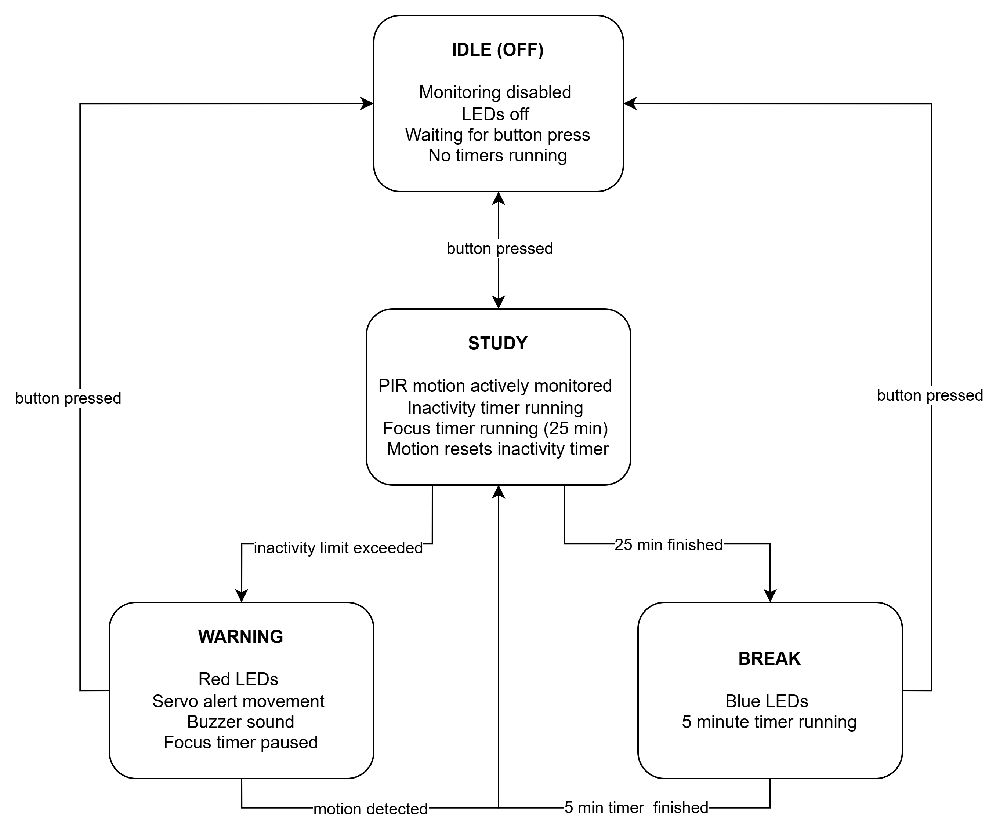

### Study Companion Robot
A cardboard desk companion powered by an ESP32 that monitors study activity using motion detection. When inactivity is detected during study mode, it alerts the user with LED eyes, servo head movement, and a buzzer to help maintain focus and manage Pomodoro cycles.

## FSM
The robot operates based on a Finite State Machine (FSM) with the following states:

## Datasheets, Schematics, and Documentations
- [ESP32 Datasheet](https://lastminuteengineers.com/esp32-pinout-reference/)
- [PIR Motion Sensor Datasheet](https://www.handsontec.com/dataspecs/SR501%20Motion%20Sensor.pdf)
- [Servo Motor Datasheet](https://handsontec.com/dataspecs/motor_fan/SG90-Servo.pdf)
- [Buzzer Datasheet](https://components101.com/misc/buzzer-pinout-working-datasheet)
- [RGB LED Datasheet](https://www.build-electronic-circuits.com/rgb-led/)
   